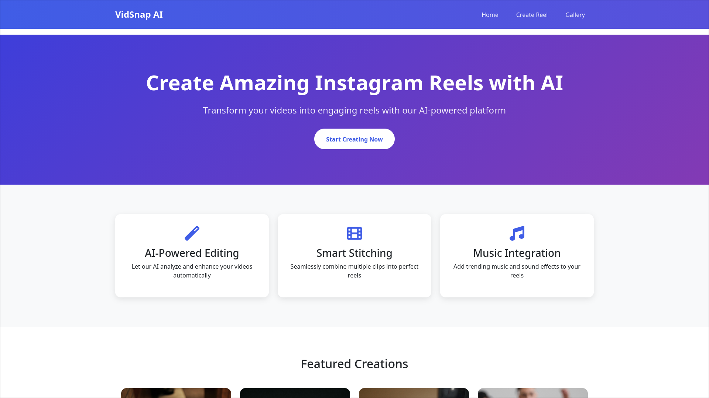
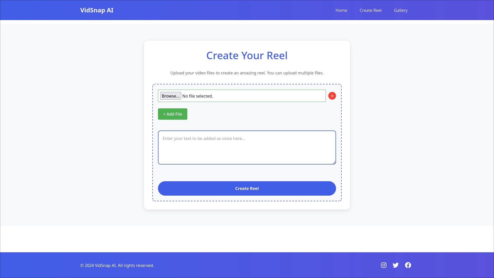
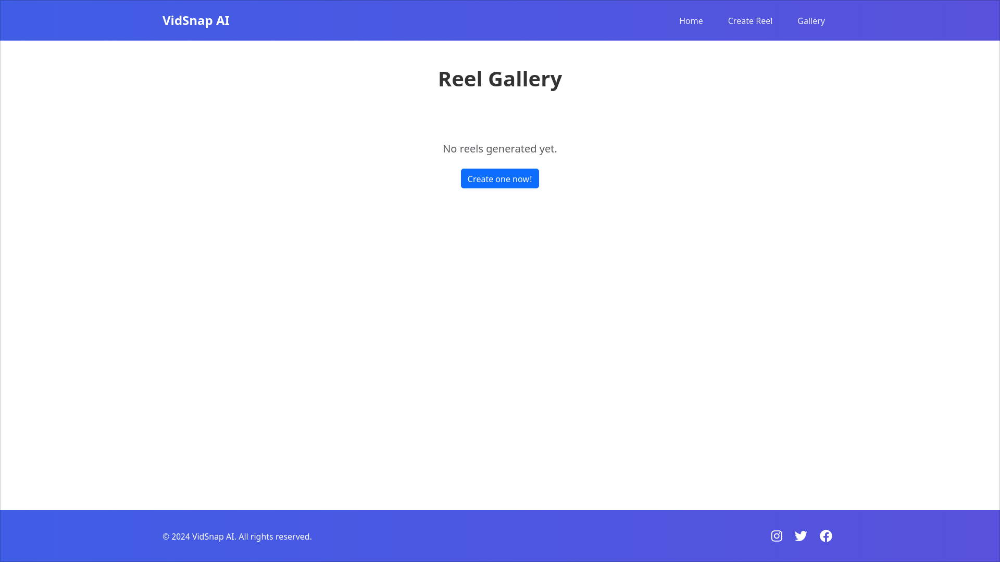
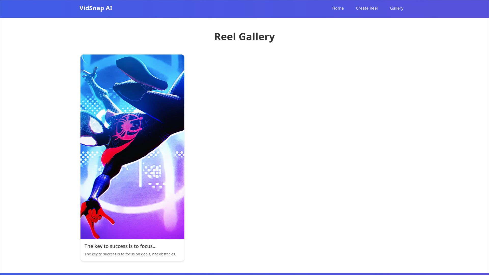

# VidSnap AI 🎬

> Create AI-powered video reels from images and text using Flask, ElevenLabs TTS, and FFmpeg.
VidSnap AI is a Flask-based web application that transforms user-uploaded images and custom text into engaging video reels.

The application uses ElevenLabs Text-to-Speech technology to convert text into natural-sounding narration and automatically combines images, audio, and visual effects into a shareable reel. Generated videos can be viewed through a built-in gallery page.

## Features

* Upload multiple images
* Enter custom text for narration
* AI-powered text-to-speech using ElevenLabs
* Automatic reel generation
* Built-in gallery for viewing generated videos
* Simple and responsive web interface

## Tech Stack

* Python
* Flask
* HTML5
* CSS3
* ElevenLabs API
* Pillow (Image Processing)
* FFmpeg
* JavaScript

## Project Workflow

1. User uploads images.
2. User enters custom text.
3. Text is converted into speech using ElevenLabs.
4. Images and audio are processed and combined.
5. A video reel is generated automatically.
6. Generated reels are displayed in the gallery.

## Installation

### Clone the repository

```bash
git clone https://github.com/Priyam792/VidSnap-AI.git
cd VidSnap-AI
```

### Install dependencies

```bash
pip install -r requirements.txt
```

### Configure Environment Variables

Create a `.env` file:

```env
ELEVENLABS_API_KEY=your_api_key_here
```

### Run the application

```bash
python main.py
```

<h2>Screenshots</h2>

<table>
  <tr>
    <td align="center">
      <b>Home Page</b><br>
      
    </td>
    <td align="center">
      <b>Create Page</b><br>
      
    </td>
  </tr>
  <tr>
    <td align="center">
      <b>Gallery Page</b><br>
      
    </td>
    <td align="center">
      <b>Generated Reel</b><br>
      
    </td>
  </tr>
</table>

## Demo Video

Download and watch the demo:

[VidSnap AI Demo](demo/Vidsnap-demo.mp4)

## Future Improvements

* Multiple voice options
* Custom background music selection
* Video templates
* Download and sharing options
* User authentication

## Author

Priyam

GitHub: https://github.com/Priyam792
